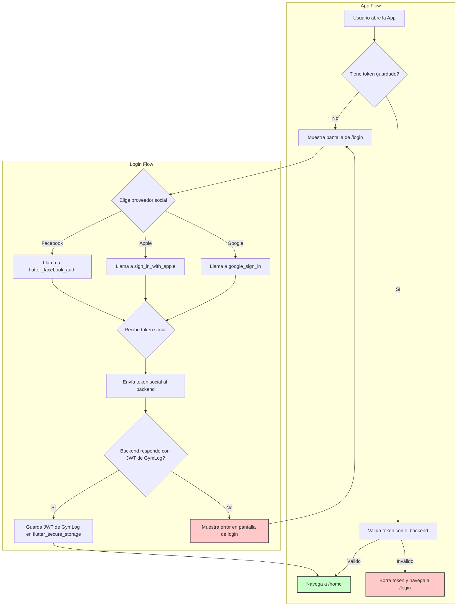

# GEMINI-flutter.md: Especificación Técnica para la App Móvil de GymLog

Este documento detalla los requisitos técnicos, la arquitectura, las características y las fases de desarrollo para la aplicación móvil de GymLog, construida con Flutter para iOS y Android. Servirá como la única fuente de verdad para la generación de código y el desarrollo de la aplicación.

## 1. Resumen Tecnológico

- **Framework:** Flutter 3.x
- **Lenguaje:** Dart 3.x
- **Arquitectura:** Clean Architecture con enfoque en "Feature-driven" (arquitectura limpia orientada a funcionalidades).
- **Gestión de Estado:** `flutter_bloc` (BLoC / Cubit) para una gestión de estado predecible y escalable.
- **Enrutamiento:** `go_router` para una navegación declarativa y basada en URLs.
- **Cliente HTTP:** `dio` para peticiones a la API, con interceptores para la gestión de tokens y errores.
- **Generación de Cliente API:** `openapi-generator-cli` para generar los modelos (DTOs) y servicios de API directamente desde el fichero `openapi.yml` del backend, asegurando la sincronización entre ambos.
- **Inyección de Dependencias:** `get_it` y `injectable` para la inversión de control y un código desacoplado.
- **Almacenamiento Seguro:** `flutter_secure_storage` para guardar de forma segura el JWT del usuario.
- **Base de Datos Local:** No incluida en la v1. La primera versión de la app requerirá conexión a internet. La funcionalidad offline se ha planificado como una mejora futura.
- **Testing:** `bloc_test`, `mockito`, `flutter_test` (Widget Tests), `integration_test`.
- **Linting:** `flutter_lints` con reglas estrictas para mantener la calidad del código.

---

## 2. Fase 1: Configuración del Proyecto y Cimientos de la Arquitectura

### **Objetivo:**
Establecer una base de proyecto sólida, escalable y mantenible. Definir la arquitectura, dependencias y herramientas que se usarán a lo largo del desarrollo.

### **Tareas Detalladas:**

**2.1. Inicialización del Proyecto Flutter**
   - Crear el proyecto usando `flutter create`.
   - Nombre del paquete: `es.gymlog.app`.
   - Configurar el `analysis_options.yaml` con reglas de linting estrictas para promover un código limpio y consistente.

**2.2. Estructura de Directorios (Feature-Driven)**
   - El código se organizará por funcionalidades para mejorar la modularidad.
   - La estructura raíz será:
     ```
     lib/
     ├── core/                  # Lógica y widgets compartidos
     │   ├── api/               # Configuración de Dio, interceptores
     │   │   └── generated/     # CÓDIGO GENERADO POR OPENAPI. NO TOCAR MANUALMENTE.
     │   ├── auth/              # Lógica de autenticación compartida
     │   ├── config/            # Configuración de entorno (dev, prod)
     │   ├── routing/           # Configuración de go_router
     │   ├── di/                # Inyección de dependencias (get_it)
     │   └── widgets/           # Widgets compartidos y adaptativos
     │       └── adaptive/      # Widgets que se adaptan a iOS/Android
     │
     ├── features/              # Directorio principal para las funcionalidades
     │   ├── auth/              # Flujo de autenticación
     │   │   ├── data/
     │   │   │   ├── datasources/ # Llamará al código generado en core/api/generated
     │   │   │   └── repositories/
     │   │   ├── domain/
     │   │   │   ├── entities/
     │   │   │   └── repositories/
     │   │   └── presentation/
     │   │       ├── bloc/
     │   │       ├── screens/
     │   │       └── widgets/
     │   │
     │   ├── routines/          # Funcionalidad de Rutinas
     │   │   └── ... (misma subestructura data/domain/presentation)
     │   │
     │   └── workout/           # Funcionalidad de Sesiones de Entrenamiento
     │       └── ... (misma subestructura)
     │
     └── main.dart              # Punto de entrada de la aplicación
     ```

**2.3. Arquitectura Limpia (Clean Architecture)**
   - **Capa de Presentación (`presentation`):** Contendrá los Widgets (Vistas), y los BLoCs/Cubits que gestionan el estado de la UI. No tendrá conocimiento de cómo se obtienen los datos. Utilizará los widgets adaptativos definidos en `core/widgets/adaptive` para asegurar una apariencia nativa en cada plataforma.
   - **Capa de Dominio (`domain`):** Contendrá las entidades de negocio (ej: `Routine`, `User`) y las definiciones abstractas de los repositorios (`RoutineRepository`). Es el núcleo de la lógica de negocio, sin dependencias de Flutter o de la capa de datos.
   - **Capa de Datos (`data`):** Implementará los repositorios de la capa de dominio. Contendrá las fuentes de datos (`DataSources`), que son las clases responsables de hacer las llamadas a la API REST. También incluirá los modelos de datos (DTOs) que mapean las respuestas JSON. **Importante:** Las `DataSources` no implementarán la lógica HTTP directamente, sino que delegarán esta tarea en el cliente de API generado por OpenAPI.

**2.4. Principio de Diseño: Interfaz Adaptativa (iOS/Android)**
   - **Requisito fundamental:** La aplicación debe sentirse nativa en ambas plataformas. Se utilizarán componentes de **Cupertino** en iOS y de **Material Design** en Android siempre que sea posible.
   - **Implementación:**
     - Se detectará la plataforma en tiempo de ejecución usando `Platform.isIOS` / `Platform.isAndroid` desde `dart:io`.
     - Se creará una biblioteca de widgets "adaptativos" personalizados en `lib/core/widgets/adaptive/`.
     - Ejemplos: `adaptive_button.dart`, `adaptive_scaffold.dart`, `adaptive_dialog.dart`.
     - Estos widgets encapsularán la lógica de selección de plataforma, manteniendo el código de las pantallas limpio y declarativo.

**2.5. Dependencias Esenciales (`pubspec.yaml`)**
   - Se añadirá el siguiente conjunto inicial de dependencias:
     ```yaml
     dependencies:
       flutter:
         sdk: flutter
       # UI
       cupertino_icons: ^1.0.2

       # Gestión de Estado
       flutter_bloc: ^8.1.3
       equatable: ^2.0.5

       # Cliente HTTP y Serialización (usado por el código generado)
       dio: ^5.3.3
       json_annotation: ^4.8.1

       # Enrutamiento
       go_router: ^11.1.2

       # Inyección de Dependencias
       get_it: ^7.6.4
       injectable: ^2.3.2

       # Almacenamiento Seguro
       flutter_secure_storage: ^9.0.0

       # Utilidades
       dartz: ^0.10.1 # Para Programación Funcional (Either, Option)

     dev_dependencies:
       flutter_test:
         sdk: flutter
       flutter_lints: ^3.0.0
       build_runner: ^2.4.6
       injectable_generator: ^2.4.1
       json_serializable: ^6.7.1 # Necesario para los modelos generados

       # Mocks para testing
       mockito: ^5.4.2
     ```

**2.6. Configuración de Entornos (Desarrollo y Producción)**
   - Se utilizará un sistema para gestionar diferentes configuraciones (ej: URL de la API).
   - Se creará un fichero de configuración (ej: `lib/core/config/app_config.dart`) que exponga la URL base de la API.
   - Se utilizarán los "entrypoints" de Dart (`main_dev.dart`, `main_prod.dart`) para lanzar la aplicación con la configuración adecuada para cada entorno.

**2.7. Configuración del Cliente HTTP (Dio)**
   - Se creará una instancia singleton de Dio.
   - Se implementará un `Interceptor` que:
     1. Lea el token JWT desde `flutter_secure_storage`.
     2. Añada el `Authorization: Bearer <token>` a la cabecera de todas las peticiones a rutas protegidas.
     3. Gestione los errores comunes (401, 403, 500) y los errores de red.
     4. En caso de un error 401 (token inválido), el interceptor deberá borrar el token local y redirigir al usuario a la pantalla de login.
   - **Esta instancia de Dio será inyectada en el cliente de API generado por OpenAPI.**

**2.8. Generación de Cliente API desde OpenAPI (API-First)**
   - **Principio:** El fichero `openapi.yml` del backend es la única fuente de verdad para la capa de red. No se escribirá manualmente ningún modelo DTO ni ninguna llamada a la API.
   - **Herramienta:** Se utilizará `openapi-generator-cli`. Se puede instalar localmente o usar a través de un contenedor Docker.
   - **Flujo de Trabajo:**
     1. Cuando haya un cambio en la API, primero se actualiza el fichero `openapi.yml`.
     2. Se ejecuta el comando de generación para actualizar el código cliente en Flutter.
     3. El código generado en `lib/core/api/generated/` se actualizará automáticamente. Este directorio NO debe ser modificado manualmente y podría ser añadido a `.gitignore` para forzar la regeneración.
   - **Comando de Generación (Ejemplo):**
     ```bash
     openapi-generator-cli generate \
         -i ../backend/openapi.yml \
         -g dart-dio \
         -o lib/core/api/generated \
         --additional-properties=pubName=gymlog_api,pubVersion=1.0.0
     ```
     * `-i`: Ruta al fichero de definición de la API.
     * `-g`: El generador a usar. `dart-dio` es ideal porque se integra con `dio`.
     * `-o`: Directorio de salida para el código generado.
     * `--additional-properties`: Permite configurar detalles del paquete generado, como su nombre.
   - **Integración:** El código generado expondrá Clases Api (ej: `RoutinesApi`, `ExercisesApi`) y todos los modelos DTO necesarios (`RoutineDTO`, etc.). Las `DataSource` de nuestra capa de datos usarán estas clases generadas para realizar las peticiones al backend.

---

## 3. Fase 2: Autenticación de Usuario

### **Objetivo:**
Implementar un flujo de autenticación completo, seguro y fluido, permitiendo a los usuarios iniciar sesión a través de proveedores sociales (Google, Apple, Facebook) y gestionar su sesión.

### **3.1. Diagrama de Flujo de Autenticación**



### **3.2. Tareas Detalladas:**

**3.2.1. Diseño de la Pantalla de Login**
   - La pantalla será simple y limpia, usando nuestros widgets adaptativos.
   - Contendrá:
     - El logo de la aplicación.
     - Un eslogan o texto de bienvenida.
     - Tres botones prominentes (adaptativos): "Continuar con Google", "Continuar con Apple", "Continuar con Facebook".
     - Un enlace a los "Términos de Servicio" y "Política de Privacidad".
   - Se mostrará un indicador de carga adaptativo (`AdaptiveCircularProgressIndicator`) mientras se procesa el inicio de sesión.

**3.2.2. Integración con Proveedores de Autenticación Social**
   - Se utilizarán los paquetes oficiales o los más recomendados por la comunidad para cada proveedor:
     - `google_sign_in` para Google.
     - `sign_in_with_apple` para Apple.
     - `flutter_facebook_auth` para Facebook.
   - **Flujo de trabajo para cada proveedor:**
     1. El usuario pulsa el botón de login social.
     2. La aplicación invoca al SDK nativo correspondiente a través del paquete de Flutter.
     3. El usuario completa el flujo de autenticación en la interfaz nativa del proveedor (ej: diálogo de selección de cuenta de Google).
     4. La aplicación recibe un **token de identidad (ID Token)** o un **token de acceso** por parte del proveedor.
     5. Este token se envía a nuestro backend para su validación y para obtener el JWT de nuestra aplicación.

**3.2.3. Lógica de Autenticación (Capa de Datos y Dominio)**
   - **`AuthRepository` (Dominio):**
     - Se definirá un método `Future<Either<Failure, User>> login(SocialProvider provider)`.
   - **`AuthRepositoryImpl` (Datos):**
     - Implementará el método `login`.
     - Contendrá una `AuthRemoteDataSource` y una `AuthLocalDataSource`.
   - **`AuthRemoteDataSource`:**
     - Será responsable de la comunicación con el backend.
     - **Utilizará el cliente `AuthApi` generado por OpenAPI.**
     - Tendrá un método que llame a la función correspondiente del cliente generado para realizar el login social.
   - **`AuthLocalDataSource`:**
     - Será responsable de persistir el token JWT.
     - Tendrá dos métodos: `Future<void> saveToken(String token)` y `Future<String?> getToken()`.
     - Usará `flutter_secure_storage` para esta tarea.

**3.2.4. Gestión de Estado de Autenticación (BLoC)**
   - Se creará un `AuthBloc` que gestionará el estado de autenticación de toda la aplicación.
   - **Estados (`AuthState`):**
     - `AuthInitial`: Estado inicial antes de comprobar la sesión.
     - `AuthAuthenticated`: El usuario ha iniciado sesión. Contendrá el objeto `User`.
     - `AuthUnauthenticated`: El usuario no ha iniciado sesión o ha cerrado la sesión.
     - `AuthLoading`: Proceso de inicio de sesión en curso.
     - `AuthFailure`: Ocurrió un error durante el inicio de sesión.
   - **Eventos (`AuthEvent`):**
     - `AuthCheckRequested`: Se dispara al iniciar la app para comprobar si ya existe un token.
     - `AuthLoginRequested(SocialProvider provider)`: Se dispara cuando el usuario pulsa un botón de login.
     - `AuthLogoutRequested`: Se dispara para cerrar la sesión del usuario.

**3.2.5. Enrutamiento y Protección de Rutas**
   - La configuración de `go_router` se actualizará para escuchar los cambios de estado del `AuthBloc`.
   - Se implementará la lógica de `redirect`:
     - Si el usuario no está autenticado (`AuthUnauthenticated`) e intenta acceder a una ruta protegida (ej: `/home`), será redirigido a `/login`.
     - Si el usuario ya está autenticado (`AuthAuthenticated`) y accede a `/login`, será redirigido a `/home`.
     - La pantalla de login (`/login`) será la ruta inicial.

---

## 4. Fase 3: Gestión de Rutinas

### **Objetivo:**
Permitir a los usuarios ver, crear, modificar y eliminar sus rutinas de entrenamiento de una manera intuitiva y eficiente.

### **Tareas Detalladas:**

**4.1. Pantalla de Lista de Rutinas (`/routines`)**
   - **Ruta:** Será la pantalla de inicio (`/home` o `/routines`) después de un login exitoso.
   - **UI:**
     - Un `AdaptiveScaffold` con un título como "Mis Rutinas".
     - Un `ListView` que muestre las rutinas del usuario. Cada elemento de la lista (`Card` o similar) mostrará:
       - El nombre de la rutina (ej: "Entrenamiento de Fuerza - 3 Días").
       - Un indicador visual (ej: un icono de estrella o una etiqueta) si la rutina está marcada como `isActive`.
     - Un Botón de Acción Flotante (`FloatingActionButton`) adaptativo para iniciar el flujo de creación de una nueva rutina (navegar a `/routines/new`).
     - Un menú de opciones en la AppBar para acceder a "Ajustes" o "Cerrar Sesión".
   - **Lógica (`RoutinesBloc`):**
     - **Estado:** `RoutinesLoading`, `RoutinesLoaded(List<Routine> routines)`, `RoutinesFailure`.
     - **Eventos:** `FetchRoutines`.
     - Al entrar en la pantalla, se dispara `FetchRoutines`. El BLoC llama al `RoutineRepository` para obtener los datos del endpoint `GET /api/v1/routines`.

**4.2. Pantalla de Detalle de Rutina (`/routines/:id`)**
   - **Navegación:** Se accede al pulsar sobre una rutina en la lista.
   - **UI:**
     - Título con el nombre de la rutina.
     - Opciones en la AppBar para "Editar" y "Eliminar" la rutina.
     - Una vista principal que agrupa los ejercicios por días (`RoutineDayDTO`). Podría ser una lista de `ExpansionPanel` o `Card` por cada día.
     - Cada día mostrará:
       - Nombre del día (ej: "Día 1: Pecho y Tríceps").
       - Una lista de los ejercicios de ese día (`RoutineExerciseDTO`), mostrando el nombre del ejercicio, orden, y notas.
     - Un botón bien visible para "Iniciar Entrenamiento" para un día específico, que navegará a la fase de registro de sesión.
   - **Lógica (`RoutineDetailBloc`):**
     - **Estado:** `RoutineDetailLoading`, `RoutineDetailLoaded(RoutineDetail routine)`, `RoutineDetailFailure`.
     - **Eventos:** `FetchRoutineDetail(String id)`, `DeleteRoutine(String id)`.

**4.3. Flujo de Creación/Edición de Rutina (`/routines/new`, `/routines/:id/edit`)**
   - **UI:**
     - Un formulario `StatefulWidget` o gestionado con un BLoC/Cubit local.
     - Campo de texto para el nombre de la rutina.
     - Un `Switch` adaptativo para marcarla como `isActive`.
     - Una sección dinámica para gestionar los días:
       - Añadir/eliminar días.
       - Para cada día: campo para el nombre y una lista reordenable (`ReorderableListView`) de ejercicios.
       - Un botón para "Añadir Ejercicio" a un día, que abriría un modal o una nueva pantalla para buscar en el banco de ejercicios (`GET /api/v1/exercises`).
   - **Lógica (`RoutineFormBloc`):**
     - Gestionará el estado del formulario, validaciones y la comunicación con el `RoutineRepository` para llamar a `POST /api/v1/routines` o `PUT /api/v1/routines/{id}`.

**4.4. Lógica de Datos (Capa de Dominio y Datos)**
   - **`RoutineRepository` (Dominio):**
     - Se añadirán los siguientes métodos:
       - `Future<Either<Failure, List<Routine>>> getAllRoutines()`
       - `Future<Either<Failure, RoutineDetail>> getRoutineById(String id)`
       - `Future<Either<Failure, Routine>> createRoutine(CreateRoutineDTO routine)`
       - `Future<Either<Failure, Routine>> updateRoutine(String id, UpdateRoutineDTO routine)`
       - `Future<Either<Failure, void>> deleteRoutine(String id)`
   - **`RoutineRepositoryImpl` (Datos):**
     - Implementará la interfaz, llamando a su `RoutineRemoteDataSource`.
   - **`RoutineRemoteDataSource` (Datos):**
     - Utilizará la API `RoutinesApi` generada por OpenAPI para realizar las llamadas HTTP.

---

## 5. Fase 4: Sesión de Entrenamiento y Registro

### **Objetivo:**
Ofrecer una experiencia fluida y enfocada para que el usuario pueda seguir el plan de su rutina y registrar su rendimiento en tiempo real.

### **Tareas Detalladas:**

**5.1. Pantalla de Sesión de Entrenamiento Activa (`/workout/:sessionId`)**
   - **Navegación:** Se accede al pulsar "Iniciar Entrenamiento" en la pantalla de detalle de rutina. Lo primero que hará es llamar a `POST /api/v1/workout-sessions` para crear la sesión y obtener su ID.
   - **UI:**
     - Una interfaz inmersiva, con pocos elementos que distraigan.
     - Un `Timer` bien visible que muestre el tiempo transcurrido de la sesión.
     - Una lista de los ejercicios (`RoutineExerciseDTO`) para el día seleccionado.
     - Cada ejercicio en la lista será un `Card` interactivo que mostrará:
       - Nombre del ejercicio.
       - Un botón para marcar el ejercicio como "completado".
       - Campos de entrada (`TextField` adaptativos) para registrar **series, repeticiones y peso (kg)**. Por ejemplo: `3 series`, `10-12 reps`, `80 kg`.
     - Un botón principal para "Finalizar Entrenamiento".
   - **Lógica (`WorkoutSessionBloc`):**
     - **Estado:** `WorkoutSessionInitial`, `WorkoutSessionActive(WorkoutSession session)`, `WorkoutSessionLogging`, `WorkoutSessionLogSuccess`, `WorkoutSessionLogFailure`, `WorkoutSessionFinished`.
     - **Eventos:** `StartWorkout(String routineDayId)`, `LogExercise(CreateExerciseLogDTO log)`, `FinishWorkout`.

**5.2. Lógica de Registro de Ejercicios**
   - Cuando el usuario rellena los datos de un ejercicio y pulsa "Guardar" (o similar), se dispara el evento `LogExercise`.
   - El `WorkoutSessionBloc` llamará al `WorkoutRepository`.
   - El `WorkoutRepository` hará la petición `POST /api/v1/workout-sessions/{sessionId}/logs` con los datos del rendimiento del usuario.
   - La UI se actualizará para mostrar que el ejercicio ha sido registrado (ej: cambiando el color del `Card` o mostrando un tick ✔️).

**5.3. Pantalla de Resumen Post-Entrenamiento (Opcional)**
   - **Navegación:** Se muestra al pulsar "Finalizar Entrenamiento".
   - **UI:**
     - Un mensaje de felicitación.
     - Un resumen de la sesión:
       - Duración total del entrenamiento.
       - Número de ejercicios completados.
       - (Opcional) Volumen total levantado (series * reps * peso).
     - Un botón para "Volver a Mis Rutinas".

**5.4. Lógica de Datos (Capa de Dominio y Datos)**
   - **`WorkoutRepository` (Dominio):**
     - `Future<Either<Failure, WorkoutSession>> startWorkoutSession(String routineDayId)`
     - `Future<Either<Failure, ExerciseLog>> logExercise(String sessionId, CreateExerciseLogDTO log)`
     - `Future<Either<Failure, WorkoutSession>> finishWorkoutSession(String sessionId)` (Nota: El backend podría no tener un endpoint para "finalizar", pero la app podría necesitar marcarlo como tal localmente o actualizar su estado).
   - **`WorkoutRepositoryImpl` (Datos):**
     - Implementará la interfaz llamando a su `WorkoutRemoteDataSource`.
   - **`WorkoutRemoteDataSource` (Datos):**
     - Utilizará las APIs generadas (`WorkoutSessionsApi`) para las llamadas HTTP.

---

## Apéndice A: Especificación de la API del Backend

Esta sección detalla los endpoints expuestos por el backend de GymLog. **Todas las rutas, a excepción de las de autenticación, requieren una cabecera `Authorization: Bearer <JWT>`**.

### Endpoints de Autenticación (Flujo Implícito)

El backend no expone un endpoint `/login` tradicional. El flujo es el siguiente:
1.  La app Flutter obtiene un **token de identidad** de un proveedor social (Google, Apple, Facebook).
2.  La app envía este token a un endpoint del backend (a definir, ej: `POST /api/v1/auth/social-login`).
3.  El backend valida este token con el proveedor original, busca o crea el usuario en su base de datos, y devuelve su propio JWT.
4.  La app Flutter usa este JWT para las siguientes peticiones a la API.

### Exercises
- **`GET /api/v1/exercises`**: Busca ejercicios en el banco global.
  - **Query Params:** `name` (string, opcional), `targetMuscleGroup` (string, opcional).
  - **Respuesta 200:** `List<ExerciseDTO>`
- **`POST /api/v1/exercises`**: Crea un nuevo ejercicio (público o privado).
  - **Body:** `CreateExerciseDTO`
  - **Respuesta 201:** `ExerciseDTO`
- **`PUT /api/v1/exercises/{id}`**: Actualiza un ejercicio creado por el usuario.
  - **Body:** `UpdateExerciseDTO`
  - **Respuesta 200:** `ExerciseDTO`

### Routines
- **`GET /api/v1/routines`**: Obtiene todas las rutinas del usuario autenticado.
  - **Respuesta 200:** `List<RoutineDTO>`
- **`POST /api/v1/routines`**: Crea una nueva rutina para el usuario.
  - **Body:** `CreateRoutineDTO`
  - **Respuesta 201:** `RoutineDTO`
- **`GET /api/v1/routines/{id}`**: Obtiene el detalle completo de una rutina.
  - **Respuesta 200:** `RoutineDetailDTO`
- **`PUT /api/v1/routines/{id}`**: Actualiza una rutina existente.
  - **Body:** `UpdateRoutineDTO`
  - **Respuesta 200:** `RoutineDTO`
- **`DELETE /api/v1/routines/{id}`**: Elimina una rutina.
  - **Respuesta 204:** No Content

### Workout Sessions
- **`POST /api/v1/workout-sessions`**: Inicia una nueva sesión de entrenamiento.
  - **Body:** `CreateWorkoutSessionDTO`
  - **Respuesta 201:** `WorkoutSessionDTO`
- **`POST /api/v1/workout-sessions/{sessionId}/logs`**: Registra el rendimiento de un ejercicio dentro de una sesión.
  - **Body:** `CreateExerciseLogDTO`
  - **Respuesta 201:** `ExerciseLogDTO`

---

## Apéndice B: Modelos de Datos (DTOs)

```json
// ExerciseDTO
{
  "id": "uuid",
  "name": "string",
  "description": "string",
  "videoUrl": "string",
  "targetMuscleGroup": "string",
  "isPublic": "boolean"
}

// RoutineDTO
{
  "id": "uuid",
  "name": "string",
  "isActive": "boolean"
}

// RoutineDetailDTO
{
  "id": "uuid",
  "name": "string",
  "isActive": "boolean",
  "days": [ /* RoutineDayDTO */ ]
}

// RoutineDayDTO
{
  "id": "uuid",
  "name": "string",
  "orderNum": "integer",
  "exercises": [ /* RoutineExerciseDTO */ ]
}

// RoutineExerciseDTO
{
  "id": "uuid",
  "exerciseId": "uuid",
  "orderNum": "integer",
  "isActive": "boolean",
  "notes": "string"
}

// WorkoutSessionDTO
{
  "id": "uuid",
  "routineDayId": "uuid",
  "startTime": "date-time",
  "endTime": "date-time",
  "notes": "string"
}

// ExerciseLogDTO
{
  "id": "uuid",
  "routineExerciseId": "uuid",
  "setsCompleted": "integer",
  "repsAchieved": "string",
  "weightKg": "number",
  "notes": "string",
  "recordedAt": "date-time"
}

// Nota: Los DTOs para creación y actualización (ej: CreateExerciseDTO) 
// son similares pero sin el 'id' y con campos opcionales/requeridos 
// según la operación.
```

---

## Apéndice C: Mejoras Futuras

Esta sección documenta funcionalidades importantes que se considerarán para futuras versiones de la aplicación.

### C.1. Funcionalidad Offline
- **Descripción:** Permitir a los usuarios acceder a sus rutinas, registrar entrenamientos y consultar ejercicios sin una conexión a internet activa. Los datos se sincronizarían con el backend una vez que se restablezca la conexión.
- **Justificación:** Mejora drásticamente la experiencia de usuario en entornos con conectividad limitada, como gimnasios.
- **Tecnologías consideradas:** `Isar` o `Drift` (a reevaluar en el momento de la implementación).
